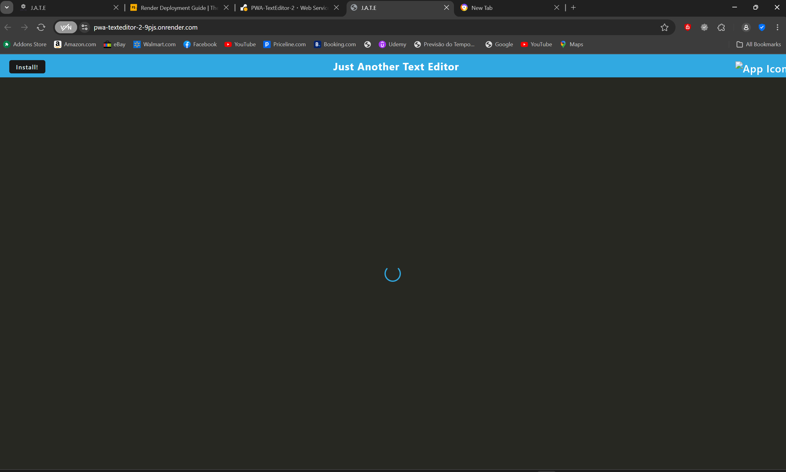
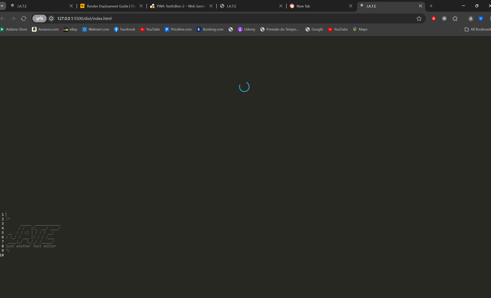
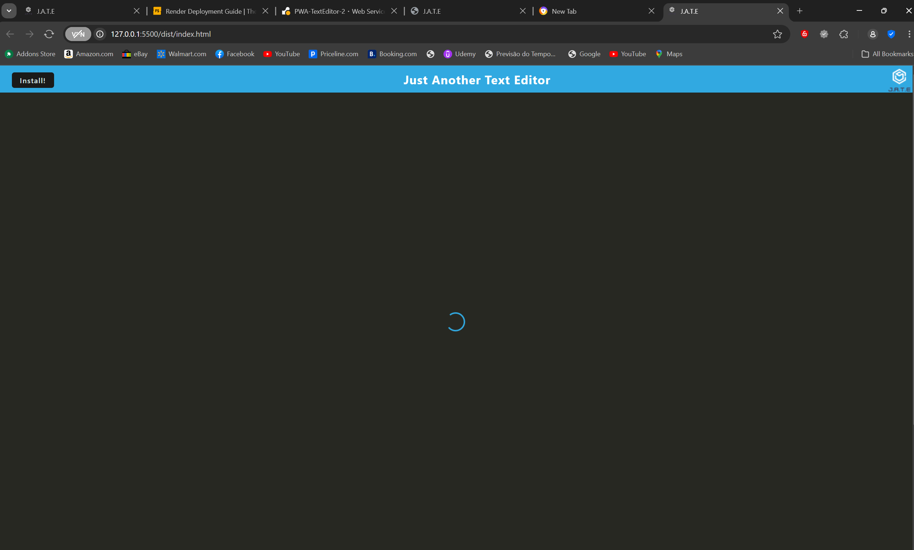

# 19 Progressive Web Applications (PWA): Text Editor

## Text Editor PWA
## Description
  This text editor is a Progressive Web App (PWA) that allows users to create notes or code snippets with or without an internet connection. It utilizes IndexedDB for data persistence, ensuring that your content is reliably saved and retrieved, even offline. On this challenge I had a hard time trying to fix 3 errors that shows in the console after starting the application and I was not able to solve it, so the application is not running 100% funtional, but when you open the index.html with live server you can see how it would work. 

## Features
  Offline Functionality: Create and edit notes without an internet connection.
  Data Persistence: Uses IndexedDB for storing content with redundancy options.
  Modern JavaScript: Built with next-gen JavaScript features for a seamless user experience.
  Service Worker: Registered service worker using Workbox for caching assets and enabling offline access.
  Desktop Installation: Install the application as a desktop icon for easy access.
## Table of Contents
  Technologies Used
  Installation
  Usage
  Deployment
  Contributing
  License
## Technologies Used
  HTML
  CSS
  JavaScript
  Webpack
  IndexedDB
  Workbox
  Node.js
## Installation
  To get a local copy up and running, follow these steps:

  **Clone the repository**

  git clone https://github.com/luccabertoldi/pwa-texteditor.git
  Navigate to the project directory:
  cd pwa-texteditor

  **Install the dependencies**
  npm install

  **Build the files**
  npm run build

  **Run the application**
  npm start

  ## Usage
  Open your browser and navigate to http://localhost:3001.
  Create notes or code snippets in the text editor.
  Your content will be automatically saved in IndexedDB when you click off the text area.
  Reopen the application to retrieve your saved content.
  Click the "Install" button to add the application to your desktop.
  Deployment
  To deploy this application to Render, ensure you have the .npmrc file included in the root directory. Follow the Render Deployment Guide to set up your deployment.

## License
  This project is licensed under the MIT License.

## Screenshots

